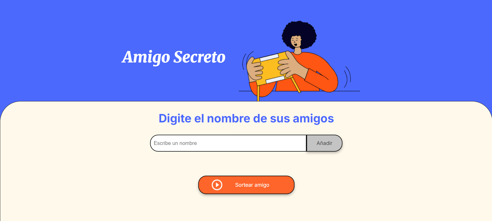
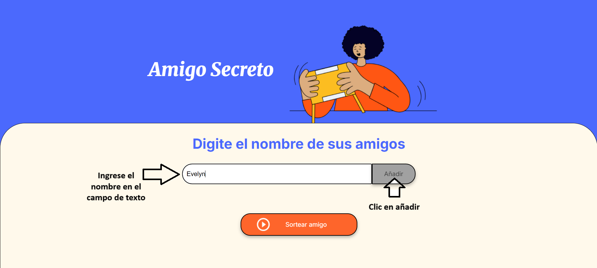
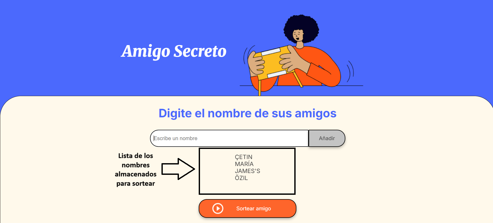
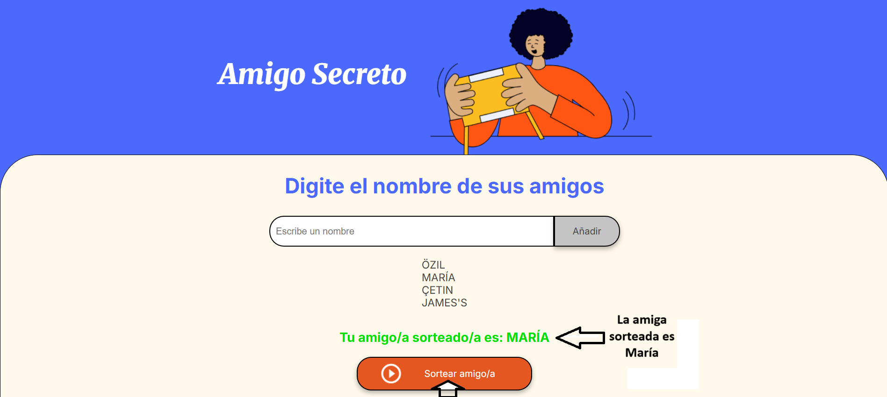
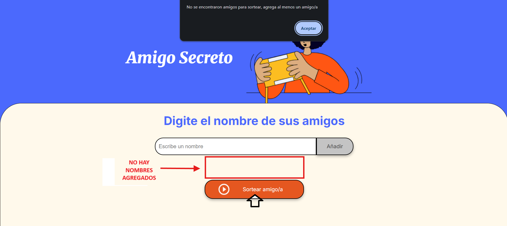
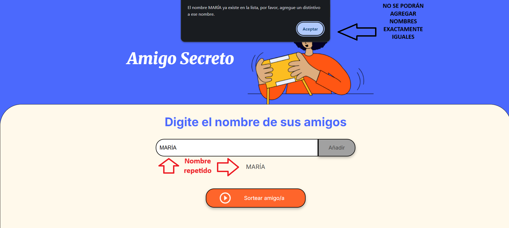
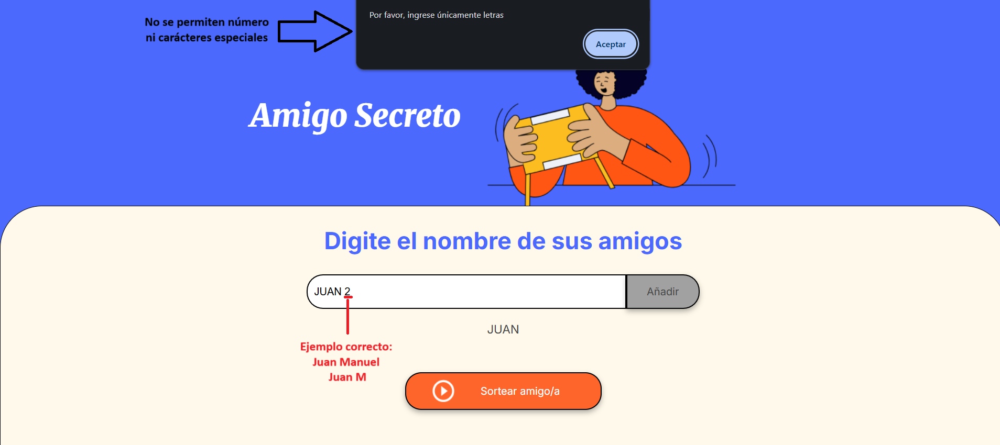

<h1 align="center">AMIGO SECRETO</h1>


## Amigo Secreto es un juego interactivo, en el cual se ingresan nombres y se guardan en una lista de amigos para sortear y obtener tu Amigo Secreto aleatoriamente



### Descripción del Juego:

1. **El usuario debe ingresar un nombre en el campo de texto y hacer clic en añadir para guardar un amigo**

2. **La lista de amigos agregados se verá abajo del campo de texto**

3. **Toca el botón sortear amigo secreto para descubrir quién será**


**REGLAS DEL JUEGO:**
1. **SI EN LA LISTA NO HAY AMIGOS, NO SE PODRÁ SORTEAR, UNA ADVERTENCIA INDICARÁ QUE INGRESEMOS AL MENOS UN AMIGO PARA PODER JUGAR**

2. **No se permite usar nombres repetidos, para evitar confusión se le debe agregar algo que lo diferencie**

3. **No se podrán ingresar carácteres especiales como signos, números, puntos, etc.** EXCEPCIONES: C con cedilla (Ç), tildes y apóstrofes


## Cómo ejecutar el proyecto

1. **Clona el repositorio:** 
**``bash:``**
```git clone https://github.com/Grz-Fer/challenge-amigo-secreto.git```

2. **Ingresa a la carpeta nombrada challenge-amigo-secreto**
**``bash:``**
```cd challenge-amigo-secreto```

3. **Abre index.html en tu navegador**
4. **También puedes descargar el proyecto, descomprimir el archivo zip y ejecutar el index.html en tu navegador**
 
**Clic** [aquí:](https://github.com/Grz-Fer/challenge-amigo-secreto/archive/refs/heads/main.zip) **para descargar el juego**
## Tecnologías usadas:


## Desarrollador: Alura Latam - ONE

## Contribuyente: Fernando Gerez

## Licencias:
**Actualmente, este proyecto no tiene una licencia específica.  Si deseas contribuir o usarlo, contáctame.**


